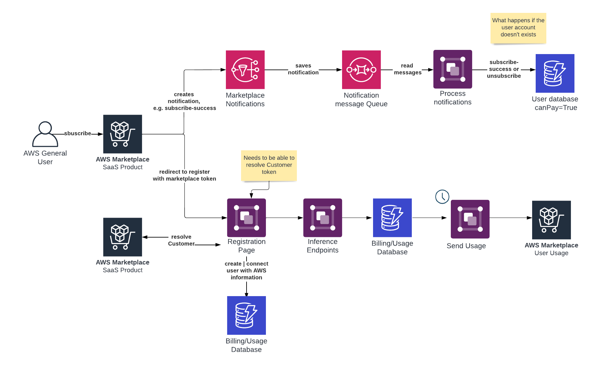

# AWS Example: for Saas Product for AWS Marketplace



## Steps to create a SaaS product for AWS Marketplace

1. Decide to list a SaaS product
2. Determine pricing and offer type
3. Collect assets
4. Submit your product for integration
5. Integrate with AWS Marketplace
6. Submit your product for launch
7. Launch


## Plan your Saas product 

Before you add your SaaS product to AWS Marketplace, you must first do some planning. This step is critical to the success of your product. A lack of planning can result in billing issues or you might have to re-create your product in AWS Marketplace.

More Guidelines: Can be found in [SaaS product guidelines](https://docs.aws.amazon.com/marketplace/latest/userguide/saas-guidelines.html)


### Billing [[REF](https://docs.aws.amazon.com/marketplace/latest/userguide/saas-pricing-models.html)]

A pay-as-you-go model where we bill buyers for their hourly usage of your SaaS product. For more information, see Pricing for [SaaS subscriptions](https://docs.aws.amazon.com/marketplace/latest/userguide/saas-subscriptions.html)

[Configuring your SaaS product to accept new buyers](https://docs.aws.amazon.com/marketplace/latest/userguide/saas-product-customer-setup.html)


The following process outlines one recommended way of identifying, implementing, and metering a new customer's access to your software:

1. When a customer visits your product page on the AWS Marketplace website, they choose to subscribe to your product.
2. The customer’s AWS account is subscribed to your product. This means subscription and metering records sent from your product become part of the customer’s AWS bill.
3. A registration token is generated for the customer that contains their customer identifier and your product code.
4. The customer is redirected to your software's registration landing page. This page must be able to accept the token with the customer’s identifier.
5. The customer’s browser sends a POST request to your software's registration landing page URL. 
6. To redeem this registration token for a customer identifier, customer AWS account Id, and product code, your website must call `ResolveCustomer` on the AWS Marketplace Metering Service. 
7. Your website validates that the product code returned matches your SaaS product that the customer is attempting to access and calls `GetEntitlement` to return the entitlement data for the customer’s subscription.
8. The customer is instructed to either create an account in your product or sign in to an existing account.
9. The customer is now signed in to your website using credentials specific to that SaaS product. In your accounts database, you can have an entry for each customer. 
10. During your seller registration process, you subscribe to Amazon SNS topics that notify you when customers subscribe or unsubscribe to your product. [Amazon SNS topic: aws-mp-subscription-notification](https://docs.aws.amazon.com/marketplace/latest/userguide/saas-notification.html#saas-sns-subscription-message-body). _Do not activate a product subscription unless you receive a subscribe-success notification._ 
11. Use the customer identifier stored in your database to meter for usage through the AWS Marketplace Metering Service or check for entitlements through the AWS Marketplace Entitlement Service.


### Notifications/Integrations [[REF](https://docs.aws.amazon.com/marketplace/latest/userguide/saas-prepare.html#saas-plan-sns)]

There are two Amazon SNS topics that you can subscribe to for your SaaS product. These messages can help you programmatically handle changes to subscriptions and contracts initiated by AWS or by your customers. You can use these Amazon SNS notifications as programmatic triggers to enable a customer to register for a new account in on your product registration website, to deny customers with expired subscriptions from accessing your product, depending on how you program the handling of these notifications.

### Registration & SaaS customer onboarding [REF](https://docs.aws.amazon.com/marketplace/latest/userguide/saas-product-customer-setup.html)

You must plan and implement how you want your customers to access the product. SaaS products support the following access options:

* [AWS PrivateLink](https://docs.aws.amazon.com/marketplace/latest/userguide/privatelink.html): customers can create a VPC endpoint and access your software across the AWS Cloud virtual network.
* public product website: registration page must accept POST request including the `x-amzn-marketplace-token` and be able to verify the customer using the marketplace apis, like [ResolveCustomer](https://docs.aws.amazon.com/marketplacemetering/latest/APIReference/API_ResolveCustomer.html) and [GetEntitlements](https://docs.aws.amazon.com/marketplaceentitlement/latest/APIReference/API_GetEntitlements.html)

--- 

After subscribing to the product, your customer is directed to a website you create and manage as a part of your SaaS product to register their account and configure the product.

The registration landing page must be able to identify and accept the x-amzn-marketplace-token token in the form data from AWS Marketplace with the customer’s identifier for billing. It should then pass that token value to the AWS Marketplace Metering Service to resolve for the unique customer identifier, customer AWS account Id, and corresponding product code. For a code example, see [ResolveCustomer code example](https://docs.aws.amazon.com/marketplace/latest/userguide/saas-code-examples.html#saas-resolvecustomer-example).

```python
# Import AWS Python SDK and urllib.parse 
import boto3
import urllib.parse as urlparse 

# Resolving Customer Registration Token
formFields = urlparse.parse_qs(postBody)
regToken = formFields['x-amzn-marketplace-token']

# If regToken present in POST request, exchange for customerID
if (regToken):
    marketplaceClient = boto3.client('meteringmarketplace')
    customerData = marketplaceClient.resolve_customer(regToken)
    productCode = customerData['ProductCode']
    customerID = customerData['CustomerIdentifier']
    customerAWSAccountId = customerData['CustomerAWSAccountId']

    # TODO: Store customer information 
    # TODO: Validate no other accounts share the same customerID
```


## Potential Registration Integration options

* Use existing landing page to add support for the features described in [Billing]().
* Create a new dedicated SaaS landing page with support for `x-amzn-marketplace-token` and `ResolveCustomer`
* Connect existing Account with AWS Marketplace Customer ID (set `canPay` true and save customer information)
* have a mix between "existing landing page" or "connect". If the customer is not having an account, create a regular one and then connect. 


## Tasks 

* [x] Create a new landing page for SaaS registration, which can register via API, e.g. Hugging Face
  * [x] demo dynamodb save
  * [ ] edge function to resolve customer information
  * [x] API to create or connect external accounts
  * [ ] CRUD
    * [ ] add delete endpoint
    * [x] add react context for "state" management
* [ ] Infrastructure
  * [ ] need PRODUCT CODE and SNS ARN to subscribe
  * [x] 3 lambda functions for resolving customer, sns subscriber and usage tracker
  * [x] sqs queue to handle sns notifications with Lambda to react to subscription changes
  * [x] test table to store customer information
  * [x] endpoint table to store endpoint information
* [ ] test and playaround on how it could work when registration is broken


## Resources 

* [AWS Marketplace SaaS Listing Process & Integration Guide](https://awsmp-loadforms.s3.amazonaws.com/AWS+Marketplace+-+SaaS+Integration+Guide.pdf)
* [Code examples for SaaS product integration](https://docs.aws.amazon.com/marketplace/latest/userguide/saas-code-examples.html)
* [AWS Marketplace - Serverless integration for SaaS products (Example)](https://github.com/aws-samples/aws-marketplace-serverless-saas-integration)